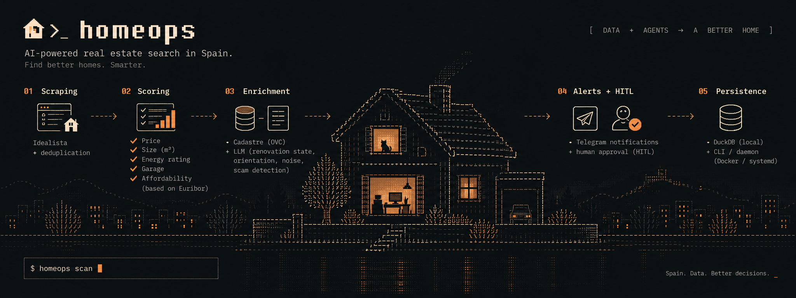
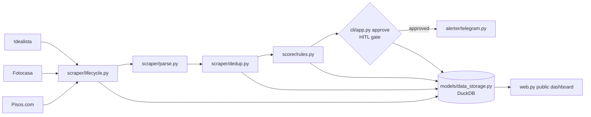

# Home-Ops

<p align="center">
  
</p>

Real estate agentic pipeline: scrape Idealista, Fotocasa & Pisos.com, score every listing across 5 dimensions, alert via Telegram.

[](https://github.com/alexramsal/home-ops/actions)
[](https://github.com/alexramsal/home-ops)
[](https://github.com/alexramsal/home-ops/blob/main/LICENSE)
[](https://github.com/alexramsal/home-ops)

## Why

Finding a flat in Spain is a race. By the time a listing appears on Idealista and you open the app, the good ones are already gone. Home-Ops checks your Idealista search every morning at 09:00 (Europe/Madrid), scores each new listing against your personal criteria, and pushes the best matches to your phone before you finish breakfast.

No daily "I should look at Idealista" mental load. Just a Telegram ping when something worth seeing appears — plus an optional public audit dashboard when you want the raw numbers.

## Features

- **Multi-portal scraping** — Idealista, Fotocasa and Pisos.com feeds in one scan; each portal fails independently without blocking the rest.
- **Public results dashboard** — a FastAPI web dashboard (dark audit console) exposes real DuckDB KPIs, the weekly snapshot and the ranked opportunity table, without login.
- **5-dimension weighted scoring** — every listing is scored against your own priorities: price, size, energy certificate, garage, and Euribor-based affordability. Weights are yours to configure.
- **Content-hash deduplication** — identical listings are detected by content hash, so only genuinely new inventory triggers an alert.
- **Human-in-the-loop approval gate** — optional manual approval before any alert is sent, so nothing reaches your phone without your sign-off.
- **Scheduled daemon** — runs on a daily or interval schedule with a per-day alert quota, catch-up recovery after downtime, and overlap protection.
- **DuckDB storage** — embedded, zero-config database that persists across restarts.
- **LLM enrichment (opt-in)** — litellm reads each description and extracts renovation state, orientation, zone noise, and LLM-judged scam red flags, persisted with full traceability.
- **Catastro OVC enrichment (opt-in)** — free public cadastral data (surface, age, usage) cross-checked against each listing.
- **DuckDB analytics** — `homeops analytics` computes price/price-per-m² percentiles, portal counts, and a per-day run time-series.
- **Structured logging (opt-in)** — one JSON object per line via `HOME_OPS_LOG_JSON=1`.
- **Docker and systemd deployment** — run it with `docker compose up` or as a hardened systemd service.

Scoring dimensions and default weights:

| Dimension | Weight |
|-----------|--------|
| price | 0.35 |
| size | 0.25 |
| energy_cert | 0.15 |
| garage | 0.10 |
| affordability | 0.15 |

## Architecture



The pipeline scrapes Idealista, Fotocasa and Pisos.com, parses and deduplicates listings, scores each one with the rules engine, gates alerts behind manual approval when enabled, and notifies you via Telegram. DuckDB records every stage, and the public web dashboard renders the real stored metrics.

## Quick start

### Option A: Docker (recommended)

```bash
git clone https://github.com/alexramsal/home-ops
cd home-ops
cp .env.example .env                              # add your Telegram secrets
cp config/user_profile.template.yml config/user_profile.yml  # set your search URL and scoring
docker compose up
```

The daemon starts, scrapes on your schedule, and alerts to Telegram. No cloud dependencies, no external services.

### Option B: Local development

```bash
python -m venv .venv && source .venv/bin/activate
pip install -e ".[dev]"
cp config/user_profile.template.yml config/user_profile.yml
homeops scan       # run one full pipeline cycle now
homeops status     # inspect pipeline state
```

## Dashboard

Home-Ops ships a read-only public dashboard that renders the real DuckDB metrics: KPIs (unique listings, observations, repeated tracking, current €/m² median, opportunities ≥ 70, risk penalty), the latest weekly snapshot, and the ranked opportunity table with direct links to each portal listing.

```bash
homeops web            # or: uvicorn home_ops.web:app --port 8321
```

Open http://localhost:8321 . The dashboard requires no login, so bind it only to localhost or put it behind an authenticated reverse proxy (see Deployment).

## Configuration

Configuration is split across two files: `.env` holds secrets, `user_profile.yml` holds your preferences. An optional `HOME_OPS_CONFIG` environment variable overrides the profile path.

### .env (secrets)

| Variable | Purpose |
|----------|---------|
| `TELEGRAM_BOT_TOKEN` | Optional unless Telegram alerting is enabled. Bot token via [@BotFather](https://t.me/BotFather). |
| `TELEGRAM_CHAT_ID` | Optional unless Telegram alerting is enabled. Chat ID for alerts; the legacy `CHAT_ID` name is also accepted. |
| `HOME_OPS_CONFIG` | Optional. Absolute path to an alternative `user_profile.yml`. |
| `HOME_OPS_DB_PATH` | Optional. DuckDB database path; defaults to `data/home_ops.duckdb`. |

### user_profile.yml (preferences)

| Key | Default | Purpose |
|-----|---------|---------|
| `portal.urls` | `[idealista_url]` | Full scan list. One entry per portal search URL (Idealista, Fotocasa, Pisos.com). Each is scanned and fails independently. |
| `scoring.thresholds.min_score_to_alert` | `70` | Minimum score before a listing is considered for alerting. |
| `scoring.thresholds.weights` | see table above | Per-dimension scoring weights. |
| `hitl_approval_required` | `true` | Require manual approval before alerts are sent. |
| `alert_schedule.daily_time` | `"09:00"` | Daily alert time (HH:MM). |
| `alert_schedule.timezone` | `"Europe/Madrid"` | Timezone for the schedule. |
| `alert_schedule.max_alerts_per_day` | `5` | Daily alert quota. |
| `euribor_rate` | `3.5` | Euribor rate used by the affordability dimension. |

Config lives outside the container — edit `config/user_profile.yml` and run `docker compose restart`.

## CLI reference

| Command | Behavior |
|---------|----------|
| `scan [CONFIG_PATH] [-f/--force]` | Run the full pipeline: scrape, deduplicate, score, alert. Cold-start and incremental modes are auto-detected; `--force` bypasses early-stop pagination. |
| `status [CONFIG_PATH]` | Rich summary: total listings, last scan time, pending HITL approvals. |
| `analytics` | Price distribution, price-per-m², portal counts, and per-day run time-series (DuckDB aggregates). |
| `snapshots-reset` | Invalidate cached scraper snapshots; the next scan performs a full cold start. |
| `approve <listing_id> [-c PATH]` | HITL gate: mark a listing as approved; alerts are sent on the next scan. |
| `daemon [-c PATH] [--dry-run]` | Schedule loop (60s tick) in daily or interval mode, with catch-up recovery, overlap guard, and daily alert quota. |

## Project layout

```
home-ops/
├── src/home_ops/
│   ├── cli/        # Typer CLI: scan, status, snapshots-reset, approve, daemon
│   ├── config/     # YAML + .env configuration loader
│   ├── models/     # Pydantic schemas and DuckDB storage
│   ├── scraper/    # lifecycle, parse, dedup
│   ├── scorer/     # rules engine and affordability model
│   └── alerter/    # Telegram notifier
├── config/         # user_profile.template.yml
├── systemd/        # homeops.service unit
├── tests/          # pytest suite (unit + CLI)
├── docker-compose.yml
├── Dockerfile
└── pyproject.toml
```

## Quality gates

Every push to `main` runs in CI (GitHub Actions):

```bash
ruff check src/                    # lint
mypy src/                          # strict type checking
pytest                            # full test suite (coverage floor 70%)
docker compose up --build         # docker smoke: image builds and runs
```

The full test suite passes on every CI run, with a 70% coverage floor enforced by the coverage gate.

## Deployment

### Docker

`docker compose` is the recommended deployment: `.env` is loaded via `env_file`, your profile is mounted read-only from `./config` into the container (`HOME_OPS_CONFIG=/app/config/user_profile.yml`), and the DuckDB database persists in the `homeops-data` volume.

```bash
docker compose up -d
docker compose logs -f homeops
```

### systemd

A hardened unit is provided in [`systemd/homeops.service`](systemd/homeops.service): runs as a dedicated non-root `homeops` user with `ProtectSystem=strict`, `PrivateTmp`, and a locked-down capability set.

```bash
sudo useradd --system --home /opt/home-ops --shell /usr/sbin/nologin homeops
sudo install -d -o homeops -g homeops -m 0750 /opt/home-ops/data
sudo install -o root -g homeops -m 0640 config/user_profile.yml /opt/home-ops/data/user_profile.yml
sudo cp systemd/homeops.service /etc/systemd/system/
sudo systemctl enable --now homeops
```

Telegram is optional: without credentials the daemon and readiness remain available; alert attempts are logged as disabled/failed.

### Backup and restore

Stop the service before copying a live DuckDB file; do not copy an active database file directly.

```bash
sudo systemctl stop homeops
sudo cp -a /opt/home-ops/data/home_ops.duckdb /secure-backups/home_ops.duckdb
sudo systemctl start homeops

# Restore: stop first, replace the database, preserve service ownership, then start.
sudo systemctl stop homeops
sudo cp /secure-backups/home_ops.duckdb /opt/home-ops/data/home_ops.duckdb
sudo chown homeops:homeops /opt/home-ops/data/home_ops.duckdb
sudo systemctl start homeops
```

### Dashboard network exposure

The dashboard has no login. Bind it only to localhost (`127.0.0.1`, the default). Remote access requires an authenticated reverse proxy or VPN; never expose the dashboard directly to an untrusted network.

## Roadmap

- [x] MVP: scrape, score, alert on Telegram
- [x] Daemon scheduler with catch-up recovery and daily quota
- [x] Human-in-the-loop approval gate
- [x] Docker deployment
- [x] Detail page scraping (exact garage price, real energy certificate)
- [x] Catastro OVC enrichment (free public cadastral data, opt-in)
- [x] LLM description enrichment + scam second-opinion (litellm, opt-in)
- [x] DuckDB analytics layer (`homeops analytics`)
- [x] Structured JSON logging (opt-in)
- [x] GHCR release pipeline on version tags
- [ ] Textual TUI for real-time pipeline monitoring
- [ ] Multi-portal support (Fotocasa, Habitaclia)

## License

[MIT](LICENSE)
