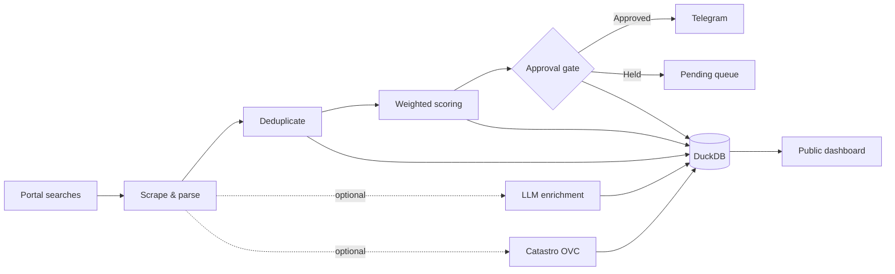

<div align="center">

# Home-Ops

### Agentic property intelligence for Spain

Scrape listings. Score opportunities. Verify signals. Get alerted before the good ones disappear.

<p>
  <a href="https://github.com/Alexramsal/home-ops/actions"></a>
  <a href="https://github.com/Alexramsal/home-ops"></a>
  <a href="https://github.com/Alexramsal/home-ops/blob/main/LICENSE"></a>
  <a href="https://github.com/Alexramsal/home-ops"></a>
</p>


</div>

> **Home-Ops turns a property search into a daily decision pipeline.** It scans configured real-estate portals, deduplicates and scores new listings against your priorities, optionally enriches them with LLM and cadastral data, and delivers the best opportunities to Telegram.

## Why Home-Ops?

Finding a good flat in Spain is a timing problem as much as a search problem. Home-Ops is built around one idea: **do the repetitive scouting automatically, surface the highest-signal listings, and keep the human in control of the final alert.**

| | What it does |
| --- | --- |
| 🔎 **Collect** | Scan Idealista, Fotocasa, Pisos.com, Tecnocasa and Habitaclia independently. |
| 🧠 **Score** | Rank listings across five weighted dimensions based on your profile. |
| 🛡️ **Enrich** | Optionally add LLM analysis and Catastro OVC cross-checks. |
| ✅ **Approve** | Keep an optional human-in-the-loop gate before Telegram alerts. |
| 📊 **Measure** | Persist the pipeline in DuckDB and expose real metrics through the dashboard. |
| ⏱️ **Automate** | Run daily or at intervals with quotas, catch-up recovery and overlap protection. |

## Pipeline



The execution path is intentionally simple: **collect → normalize → deduplicate → score → approve → alert**, with DuckDB recording the pipeline state and the dashboard reading directly from that stored data.

## Scoring model

Every listing receives a weighted score from five dimensions. The weights live in `config/user_profile.yml`, so the model follows your priorities rather than a fixed global ranking.

| Dimension | Default weight | Signal |
| --- | ---: | --- |
| Price | **35%** | Price fit against your target range |
| Size | **25%** | Surface-area fit |
| Energy certificate | **15%** | Energy-efficiency signal |
| Garage | **10%** | Garage / parking preference |
| Affordability | **15%** | Euribor-based affordability |

**Alert threshold:** `70` by default.

## Features

### Multi-portal collection
Idealista, Fotocasa, Pisos.com, Tecnocasa and Habitaclia can be scanned in one run. Each source fails independently, so a problem in one portal does not block the rest of the pipeline.

### Content-hash deduplication
Listings are fingerprinted by content so repeated observations do not become repeated alerts. Only genuinely new inventory is promoted through the alert path.

### Human-in-the-loop alerts
Set `hitl_approval_required: true` to require manual approval before a listing can reach Telegram.

### Optional intelligence layers
LLM enrichment can extract renovation state, orientation, zone noise and potential scam red flags. Catastro OVC enrichment can cross-check public cadastral attributes such as surface, age and usage. Both are opt-in and their results are persisted for traceability.

### Analytics + dashboard
The project ships with a FastAPI dashboard backed by the real DuckDB dataset. It exposes KPIs, a weekly snapshot and the ranked opportunity table, while `homeops analytics` provides price, €/m², portal and run-time aggregates.

### Automation built for long-running operation
The daemon supports daily or interval schedules, daily alert quotas, catch-up recovery after downtime and overlap protection.

## AI Agent Onboarding ("Clone & Talk")

Home-Ops includes a native integration contract ([`AGENTS.md`](AGENTS.md)) compatible with Claude Code, Codex, OpenCode, Pi, Hermes, and any agent opening the repository.

```bash
git clone https://github.com/Alexramsal/Home-Ops.git && cd Home-Ops && uv sync
```

Open your AI agent in the repository and tell it in natural language:
> *"Configure my property search in Cádiz with a maximum budget of €250,000 and 80 m² minimum"*

The agent will use validated CLI commands without directly querying the database or manually editing YAML:

| Command | Action |
| --- | --- |
| `uv run homeops profile validate` | Validate `user_profile.yml` structure and values. |
| `uv run homeops profile set KEY VALUE` | Atomically update a configuration key (e.g. `scoring.thresholds.price_median`). |
| `uv run homeops sources validate URL` | Test if a candidate URL belongs to a supported portal and parses listings. |
| `uv run homeops sources add URL` | Validate and append a URL to `portal.urls` in `user_profile.yml`. |
| `uv run homeops scan` | Run a full scrape → dedup → score → alert cycle. |
| `uv run homeops status` | Inspect pipeline state and pending approvals in DuckDB. |

> 🔒 **Financial Privacy:** Sensitive financial data (income, savings, maximum mortgage payment) stays exclusively in local `.env` or `user_profile.yml` files. It is **never** sent in search URLs or to external property portals. If using a cloud-hosted agent, do not include salaries or bank details in the chat.

## Quick start

### Docker — recommended

```bash
git clone https://github.com/Alexramsal/home-ops.git
cd home-ops

cp .env.example .env
cp config/user_profile.template.yml config/user_profile.yml

# Add your Telegram credentials and configure the search profile.
docker compose up
```

### Local development

```bash
python -m venv .venv
source .venv/bin/activate
pip install -e ".[dev]"

cp config/user_profile.template.yml config/user_profile.yml

homeops scan
homeops status
```

## Dashboard and Modal deployment

**Public read-only demo:** [home-ops-web on Modal](https://alejandrors21--home-ops-web-web.modal.run)

Run the read-only dashboard locally with:

```bash
homeops web
# or
uvicorn home_ops.web:app --port 8321
```

Then open `http://localhost:8321`.

Deploy the current read-only DuckDB snapshot to Modal with `modal deploy modal_app.py`.

The public deployment contains a read-only database snapshot and exposes no credentials or write routes. For private/live datasets, keep the dashboard bound to localhost or place it behind an authenticated reverse proxy / VPN.

## Configuration

Home-Ops keeps **secrets** and **preferences** separate:

### `.env`

| Variable | Purpose |
| --- | --- |
| `TELEGRAM_BOT_TOKEN` | Telegram bot token; required only when Telegram alerting is enabled. |
| `TELEGRAM_CHAT_ID` | Telegram destination chat ID. The legacy `CHAT_ID` name is also accepted. |
| `HOME_OPS_CONFIG` | Optional absolute path to an alternative `user_profile.yml`. |
| `HOME_OPS_DB_PATH` | Optional DuckDB path; defaults to `data/home_ops.duckdb`. |

### `config/user_profile.yml`

| Key | Default | Purpose |
| --- | --- | --- |
| `portal.urls` | `[idealista_url]` | Search URLs to scan across supported portals. |
| `scoring.thresholds.min_score_to_alert` | `70` | Minimum score before a listing becomes alert-eligible. |
| `scoring.thresholds.weights` | See scoring table | Per-dimension scoring weights. |
| `hitl_approval_required` | `true` | Require approval before alerting. |
| `alert_schedule.daily_time` | `"09:00"` | Daily alert time. |
| `alert_schedule.timezone` | `"Europe/Madrid"` | Schedule timezone. |
| `alert_schedule.max_alerts_per_day` | `5` | Daily alert quota. |
| `euribor_rate` | `3.5` | Rate used by the affordability dimension. |

## CLI

| Command | Purpose |
| --- | --- |
| `homeops profile validate` | Validate `user_profile.yml` structure and values. |
| `homeops profile set KEY VALUE` | Atomically update a configuration key (e.g. `scoring.thresholds.price_median`). |
| `homeops sources validate URL` | Test if a URL belongs to a supported portal and parses listings. |
| `homeops sources add URL` | Validate and append a URL to `portal.urls` in `user_profile.yml`. |
| `homeops scan` | Run a full scrape → dedup → score → alert cycle. |
| `homeops status` | Inspect pipeline state and pending approvals. |
| `homeops analytics` | Show price, €/m², portal and per-day run analytics. |
| `homeops snapshots-reset` | Invalidate cached scraper snapshots for a fresh cold start. |
| `homeops approve <listing_id>` | Approve a pending listing for the next alert cycle. |
| `homeops daemon` | Start the scheduled daily / interval execution loop. |

Useful flags such as `--force`, `--dry-run` and custom config paths are available on the corresponding commands.

## Project structure

```text
home-ops/
├── src/home_ops/
│   ├── cli/        # Typer commands and daemon entry points
│   ├── config/     # YAML + .env configuration
│   ├── models/     # Pydantic schemas + DuckDB storage
│   ├── scraper/    # lifecycle, parsing and deduplication
│   ├── scorer/     # scoring rules + affordability model
│   └── alerter/    # Telegram notifications
├── config/         # user profile template
├── systemd/        # hardened service unit
├── tests/          # unit + CLI tests
├── docker-compose.yml
├── Dockerfile
└── pyproject.toml
```

## Quality gates

Every push to `main` runs the CI pipeline with:

```bash
ruff check src/
mypy src/
pytest

docker compose up --build
```

The test suite enforces a **70% coverage floor** and CI also performs a Docker smoke check.

## Deployment

### Docker

```bash
docker compose up -d
docker compose logs -f homeops
```

The compose deployment loads `.env`, mounts the profile read-only, and persists DuckDB in the `homeops-data` volume.

### systemd

A hardened unit is included at [`systemd/homeops.service`](systemd/homeops.service). It is designed to run under a dedicated non-root `homeops` user with filesystem and capability restrictions.

```bash
sudo useradd --system --home /opt/home-ops --shell /usr/sbin/nologin homeops
sudo install -d -o homeops -g homeops -m 0750 /opt/home-ops/data
sudo install -o root -g homeops -m 0640 config/user_profile.yml /opt/home-ops/data/user_profile.yml
sudo cp systemd/homeops.service /etc/systemd/system/
sudo systemctl enable --now homeops
```

### Backup & restore

Stop the service before copying a live DuckDB database.

```bash
sudo systemctl stop homeops
sudo cp -a /opt/home-ops/data/home_ops.duckdb /secure-backups/home_ops.duckdb
sudo systemctl start homeops
```

For restore, stop the service, replace the database, preserve ownership, then start it again.

## Security notes

> [!WARNING]
> The dashboard has **no login**. The public Modal demo is intentionally read-only and contains no secrets; private/live datasets still require an authenticated reverse proxy or VPN.

> [!NOTE]
> Telegram is optional. Without Telegram credentials, the daemon and readiness remain available and alert attempts are recorded as disabled / failed.

## Language

The web dashboard, TUI and setup wizard are bilingual (Spanish default, English selectable).

- Set `HOME_OPS_LANG=es|en` in `.env` (or the environment) to pick the UI language.
- The setup wizard (`homeops setup`) includes a **General → Interface language** selector that persists `HOME_OPS_LANG`.
- The web dashboard detects the browser `Accept-Language` header and offers a manual ES/EN switcher; missing values fall back to Spanish.

## License

Released under the [MIT License](LICENSE).

<div align="center">

**Home-Ops** · automate the hunt, keep the human in the loop.

</div>
