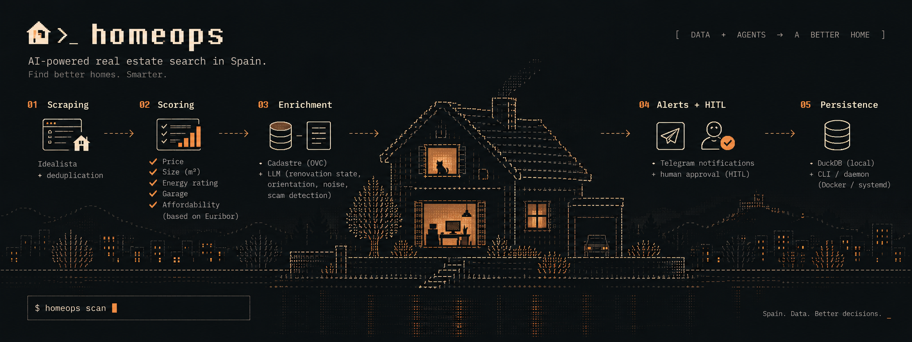
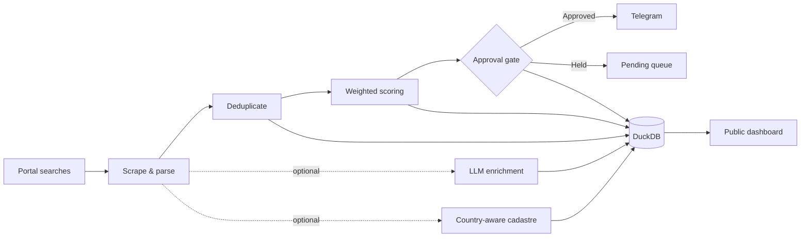

<div align="center">

# Home-Ops

### Clone & Talk property intelligence for international home searches

Scrape listings. Score opportunities. Verify signals. Get alerted before the good ones disappear.

<p>
  <a href="https://github.com/Alexramsal/home-ops/actions"></a>
  <a href="https://github.com/Alexramsal/home-ops"></a>
  <a href="https://github.com/Alexramsal/home-ops/blob/main/LICENSE"></a>
  <a href="https://github.com/Alexramsal/home-ops"></a>
</p>



</div>

> **Home-Ops turns a property search into a daily decision pipeline.** It scans configured real-estate portals, deduplicates and scores new listings against your priorities, optionally enriches them with LLM and cadastral data, and delivers the best opportunities to Telegram.

## Why Home-Ops?

Finding a good home is a timing problem as much as a search problem. Home-Ops is built around one idea: **use an agent to discover and adapt relevant sources, surface high-signal listings, and keep the human in control of the final decision.** Coverage is country-aware, not a promise of universal scraping.

| | What it does |
| --- | --- |
| 🔎 **Collect** | Let the agent discover, adapt and validate relevant property portals for the requested location. |
| 🧠 **Score** | Rank listings across five weighted dimensions based on your profile. |
| 🛡️ **Enrich** | Optionally add LLM analysis and country-aware cadastral checks where supported. |
| ✅ **Approve** | Keep an optional human-in-the-loop gate before Telegram alerts. |
| 📊 **Measure** | Persist the pipeline in DuckDB and expose real metrics through the dashboard. |
| ⏱️ **Automate** | Run daily or at intervals with quotas, catch-up recovery and overlap protection. |

## Pipeline


```mermaid
flowchart LR
    A[Portal searches] --> B[Scrape & parse]
    B --> C[Deduplicate]
    C --> D[Weighted scoring]
    D --> E{Approval gate}
    E -->|Approved| F[Telegram]
    E -->|Held| G[Pending queue]

    C --> H[(DuckDB)]
    D --> H
    E --> H
    H --> I[Public dashboard]

    B -. optional .-> J[LLM enrichment]
    B -. optional .-> K[Country-aware cadastre]
    J --> H
    K --> H
```

The execution path is intentionally simple: **collect → normalize → deduplicate → score → approve → alert**, with DuckDB recording the pipeline state and the dashboard reading directly from that stored data.

## Scoring model

Every listing receives a weighted score from five dimensions. The weights live in `config/user_profile.yml`, so the model follows your priorities rather than a fixed global ranking.

| Dimension | Default weight | Signal |
| --- | ---: | --- |
| Price | **35%** | Price fit against your target range |
| Size | **25%** | Surface-area fit |
| Energy certificate | **15%** | Energy-efficiency signal |
| Garage | **10%** | Garage / parking preference |
| Affordability | **15%** | Euribor-based affordability |

**Alert threshold:** `70` by default.

## Features

### Multi-portal collection
The agent starts from the requested country and municipality, discovers relevant local portals, and validates each source before use. Fifteen built-in adapters provide reusable coverage; unknown portals follow the explicit adaptation and test workflow. Each source fails independently, so one blocked portal does not stop the rest of the pipeline.

### Content-hash deduplication
Listings are fingerprinted by content so repeated observations do not become repeated alerts. Only genuinely new inventory is promoted through the alert path.

### Human-in-the-loop alerts
Set `hitl_approval_required: true` to require manual approval before a listing can reach Telegram.

### Optional intelligence layers
Each result includes a direct link and a personalized deterministic 0–100 score. An optional LLM audit separately reviews condition/renovation, orientation, noise/area, red flags and recommendation; it does not replace the score. Neither output substitutes for viewing, an appraisal, a land-registry extract, a technical inspection or legal advice. Catastro OVC enrichment can cross-check public cadastral attributes where available.

### Analytics + dashboard
The project ships with a FastAPI dashboard backed by the real DuckDB dataset. It exposes KPIs, a weekly snapshot and the ranked opportunity table, while `homeops analytics` provides price, €/m², portal and run-time aggregates.

### Automation built for long-running operation
The daemon supports daily or interval schedules, daily alert quotas, catch-up recovery after downtime and overlap protection.

## AI Agent Onboarding ("Clone & Talk")

Describe the home. The agent handles the operational details.

```bash
git clone https://github.com/Alexramsal/Home-Ops.git && cd Home-Ops && uv sync
```

Open a compatible coding agent in the project root, then say: *"Busco vivienda en Chiclana de la Frontera por menos de 250.000 €, mínimo 80 m² y preferiblemente garaje."* The agent confirms country, municipality, buy/rent, budget, surface and preferences.

[`AGENTS.md`](AGENTS.md) is the operational contract. The CLI is the only validated write surface: no direct DuckDB queries or manual YAML edits. Clone & Talk means the agent discovers and adapts sources; the CLI is not a universal autonomous scraper.

| Source state | Meaning |
| --- | --- |
| `candidate` | Relevant portal discovered for this location; not integrated. |
| `supported` | One of the 15 built-in runtime adapters. |
| `verified` | `sources validate URL --config FILE` parsed a sample for the requested municipality. |
| `blocked` | Access failed or adaptation could not be verified; report the exact failure and offer an alternative source. |

| Command | Action |
| --- | --- |
| `uv run homeops profile init [--config FILE]` | Create a profile without overwriting an existing one. |
| `uv run homeops profile set KEY VALUE [--config FILE]` | Atomically update a key: `search.max_price` is a search criterion/intent used when building sources; `scoring.price_median` is scoring threshold. |
| `uv run homeops profile validate [--config FILE]` | Validate `user_profile.yml`. |
| `uv run homeops sources validate URL [--config FILE]` | Verify supported URL, parseable sample and municipality. |
| `uv run homeops sources add URL [--config FILE]` | Persist a verified URL in `portal.urls`. |
| `uv run homeops scan` | Run scrape, deduplication, scoring and alert cycle. |
| `uv run homeops status` | Inspect pipeline state and pending approvals. |
| `uv run homeops approve LISTING_ID` | Approve a pending listing for alert delivery. |

Built-in runtime adapters (15): Idealista, Fotocasa, Pisos.com, Tecnocasa, Habitaclia, Njuškalo, Kleinanzeigen, Bien’ici, Green-Acres, Funda, ERA, Mäklarhuset, Nieruchomosci-online, Sreality and Daft. This is a starting set, not the product boundary: Clone & Talk selects sources by location and can extend the repository with a tested adapter when a relevant local portal is missing. `max_price`/`min_area_sqm` express search intent in URLs and are applied as strict runtime post-filters (`home_ops.scraper.filter`). An ingested listing or link may later be removed or blocked; availability is never eternal. Reproducible support requires fixtures/tests plus live `sources validate`; no successful scan is promised while a portal blocks access.

After one consolidated user confirmation, Clone & Talk handles a local portal without an adapter by inspecting permitted real HTML/JSON, selecting the cheapest permitted strategy, then having the repository agent implement and verify a shared-contract parser with registration and pagination, a sanitized fixture and TDD tests, real `sources validate`, and a smoke scan. Only then is the source `verified` and persisted. Failure means `blocked`, with the exact error and an alternative source. Runtime code does not generate unsafe dynamic adapters.

Permitted anti-bot ladder: ordinary fetch; embedded JSON/state or public API; supported `Scrapling StealthyFetcher` with a real browser; an authorized browser using the user's own profile; alternative source. An authorized browser may execute page JavaScript within its isolation for rendering; never download or execute external scripts/binaries in shell or host. Respect ToS, robots, rate limits and legal basis. Do not automate or solve CAPTCHAs, use anti-CAPTCHA services, use another person's cookies, sessions or credentials, or evade authentication, paywalls or access controls. Do not use `solve_cloudflare=True` unless a future explicit decision identifies a Cloudflare challenge. A 403 does not warrant infinite retries.

For cadastre or land-registry data, use `home_ops.cadastre.registry` to identify access. Cadastre, maps and valuation differ from the legal registry of ownership and encumbrances. Automate only through a public, tested runtime client; otherwise use manual or regional access. An absent country needs a tested official entry before support is claimed.

Human control remains explicit: keep secrets local in `.env`; give one consolidated confirmation before verified sources and profile changes are saved; retain final human-in-the-loop approval for every opportunity.

> 🔒 **Financial Privacy:** Cloud-hosted agents process chat content. Do not paste salaries, savings, bank details, or tokens into the conversation. Keep sensitive financial data and credentials local in `.env` or `user_profile.yml`; never include them in search URLs or send them to external property portals.

## Quick start

### Docker — recommended

```bash
git clone https://github.com/Alexramsal/home-ops.git
cd home-ops

cp .env.example .env
cp config/user_profile.template.yml config/user_profile.yml

# Add your Telegram credentials and configure the search profile.
docker compose up
```

### Local development

```bash
python -m venv .venv
source .venv/bin/activate
pip install -e ".[dev]"

cp config/user_profile.template.yml config/user_profile.yml

homeops scan
homeops status
```

## Dashboard and Modal deployment

**Public read-only demo:** [home-ops-web on Modal](https://alejandrors21--home-ops-web-web.modal.run). This is a historical, read-only snapshot dated 2026-09-16: 760 properties across five portals. It is not current and makes no claim about France.

Run the read-only dashboard locally with:

```bash
homeops web
# or
uvicorn home_ops.web:app --port 8321
```

Then open `http://localhost:8321`.

Deploy the current read-only DuckDB snapshot to Modal with `modal deploy modal_app.py`.

The public deployment contains a read-only database snapshot and exposes no credentials or write routes. For private/live datasets, keep the dashboard bound to localhost or place it behind an authenticated reverse proxy / VPN.

## Configuration

Home-Ops keeps **secrets** and **preferences** separate:

### `.env`

| Variable | Purpose |
| --- | --- |
| `TELEGRAM_BOT_TOKEN` | Telegram bot token; required only when Telegram alerting is enabled. |
| `TELEGRAM_CHAT_ID` | Telegram destination chat ID. The legacy `CHAT_ID` name is also accepted. |
| `HOME_OPS_CONFIG` | Optional absolute path to an alternative `user_profile.yml`. |
| `HOME_OPS_DB_PATH` | Optional DuckDB path; defaults to `data/home_ops.duckdb`. |

### `config/user_profile.yml`

| Key | Default | Purpose |
| --- | --- | --- |
| `portal.urls` | `[idealista_url]` | Search URLs to scan across supported portals. |
| `scoring.min_score_to_alert` | `70` | Minimum score before a listing becomes alert-eligible. |
| `scoring.weights` | See scoring table | Per-dimension scoring weights. |
| `hitl_approval_required` | `true` | Require approval before alerting. |
| `alert_schedule.daily_time` | `"09:00"` | Daily alert time. |
| `alert_schedule.timezone` | `"Europe/Madrid"` | Schedule timezone. |
| `alert_schedule.max_alerts_per_day` | `5` | Daily alert quota. |
| `euribor_rate` | `3.5` | Rate used by the affordability dimension. |

## CLI

| Command | Purpose |
| --- | --- |
| `homeops profile init` | Create a profile without overwriting an existing one. |
| `homeops profile validate` | Validate `user_profile.yml` structure and values. |
| `homeops profile set KEY VALUE` | Atomically update a configuration key (e.g. `scoring.price_median`). |
| `homeops location inspect <loc>` | Geocode location (ISO/municipality) via Nominatim. |
| `homeops cadastre show <country>` | Inspect cadastral registry provider for a country. |
| `homeops adapter verify <portal>` | Verify parser engine registration for a supported portal. |
| `homeops sources validate URL` | Test if a URL belongs to a supported portal and parses listings. |
| `homeops sources add URL` | Validate and append a URL to `portal.urls` in `user_profile.yml`. |
| `homeops scan` | Run a full scrape → dedup → score → alert cycle. |
| `homeops status` | Inspect pipeline state and pending approvals. |
| `homeops analytics` | Show price, €/m², portal and per-day run analytics. |
| `homeops snapshots-reset` | Invalidate cached scraper snapshots for a fresh cold start. |
| `homeops approve <listing_id>` | Approve a pending listing for the next alert cycle. |
| `homeops daemon` | Start the scheduled daily / interval execution loop. |

Useful flags such as `--force`, `--dry-run` and custom config paths are available on the corresponding commands.

## Project structure

```text
home-ops/
├── src/home_ops/
│   ├── cli/        # Typer commands and daemon entry points
│   ├── config/     # YAML + .env configuration
│   ├── models/     # Pydantic schemas + DuckDB storage
│   ├── scraper/    # lifecycle, parsing and deduplication
│   ├── scorer/     # scoring rules + affordability model
│   └── alerter/    # Telegram notifications
├── config/         # user profile template
├── systemd/        # hardened service unit
├── tests/          # unit + CLI tests
├── docker-compose.yml
├── Dockerfile
└── pyproject.toml
```

## Quality gates & Engineering standard

The codebase is built under strict senior engineering guidelines:

- **896 Automated Tests**: Unit, integration, CLI, TUI, web and international scraper parsers.
- **84.25% Test Coverage**: Far exceeding the 70% CI coverage budget.
- **Ruff clean; Mypy clean** across 58 source files.
- **Modular CLI Architecture**: Single-responsibility submodules (`scan_runner`, `daemon`, `status`, `analytics`, `profile`, `sources`).
- **Strict Static Typing & Linting**: `mypy` zero-errors and `ruff` formatting.

Run quality verification locally:

```bash
uv run pytest
uv run ruff check src tests
uv run mypy src
```

## Deployment

### Docker

```bash
docker compose up -d
docker compose logs -f homeops
```

The compose deployment loads `.env`, mounts the profile read-only, and persists DuckDB in the `homeops-data` volume.

### systemd

A hardened unit is included at [`systemd/homeops.service`](systemd/homeops.service). It is designed to run under a dedicated non-root `homeops` user with filesystem and capability restrictions.

```bash
sudo useradd --system --home /opt/home-ops --shell /usr/sbin/nologin homeops
sudo install -d -o homeops -g homeops -m 0750 /opt/home-ops/data
sudo install -o root -g homeops -m 0640 config/user_profile.yml /opt/home-ops/data/user_profile.yml
sudo cp systemd/homeops.service /etc/systemd/system/
sudo systemctl enable --now homeops
```

### Backup & restore

Stop the service before copying a live DuckDB database.

```bash
sudo systemctl stop homeops
sudo cp -a /opt/home-ops/data/home_ops.duckdb /secure-backups/home_ops.duckdb
sudo systemctl start homeops
```

For restore, stop the service, replace the database, preserve ownership, then start it again.

## Security notes

> [!WARNING]
> The dashboard has **no login**. The public Modal demo is intentionally read-only and contains no secrets; private/live datasets still require an authenticated reverse proxy or VPN.

> [!NOTE]
> Telegram is optional. Without Telegram credentials, the daemon and readiness remain available and alert attempts are recorded as disabled / failed.

## Language

The web dashboard, TUI and setup wizard are bilingual (Spanish default, English selectable).

- Set `HOME_OPS_LANG=es|en` in `.env` (or the environment) to pick the UI language.
- The setup wizard (`homeops setup`) includes a **General → Interface language** selector that persists `HOME_OPS_LANG`.
- The web dashboard detects the browser `Accept-Language` header and offers a manual ES/EN switcher; missing values fall back to Spanish.

## License

Released under the [MIT License](LICENSE).

<div align="center">

**Home-Ops** · automate the hunt, keep the human in the loop.

</div>
